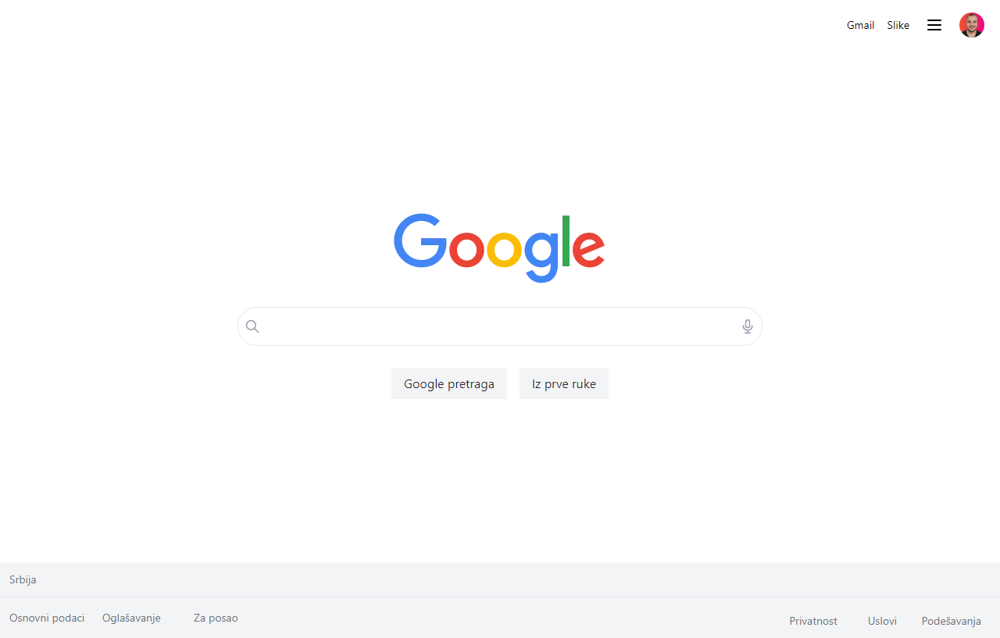

# Google Clone

<a href="https://google-clone-alpha-nine.vercel.app/" target="_blank">WEBSITE LINK</a>

## Desktop Version



## Getting Started

First, run the development server:

```bash
npm run dev
# or
yarn dev
```

Open [http://localhost:3000](http://localhost:3000) with your browser to see the result.
